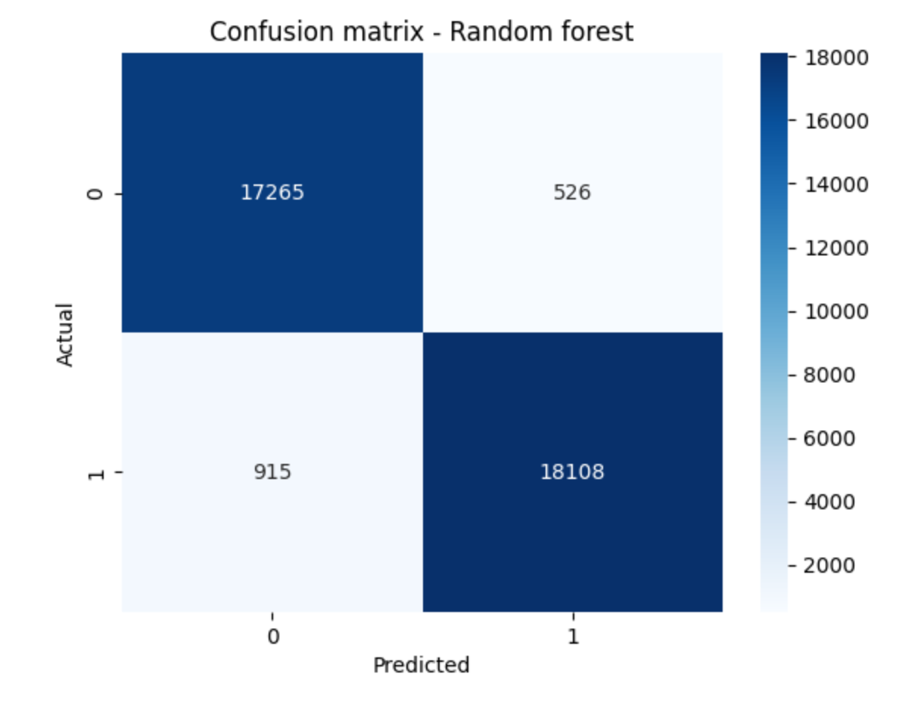
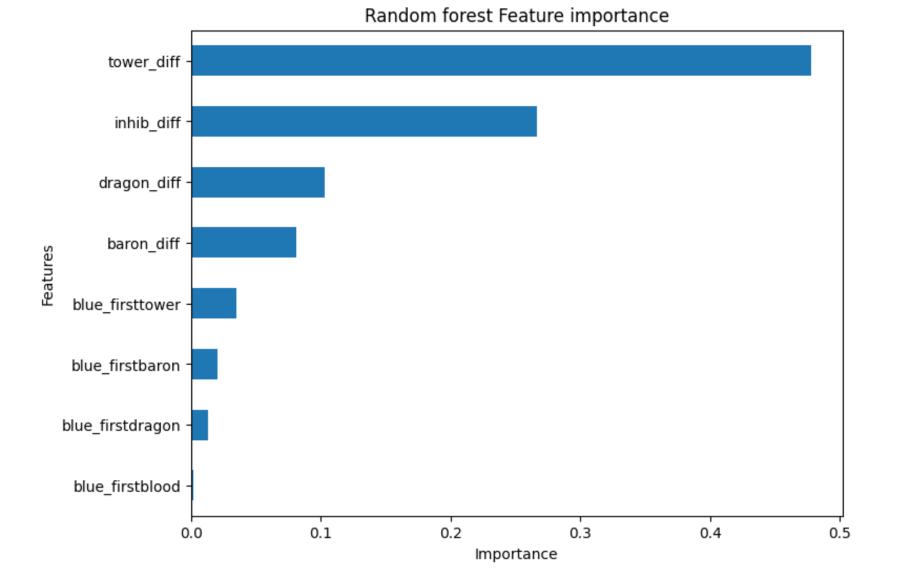

<h1>Goal</h1>

Analyze League of Legends match data and build a model to predict match outcomes using in-game statistics (focusing on the game objectives).

<h2>Dataset used</h2>

<a href="https://www.kaggle.com/datasets/paololol/league-of-legends-ranked-matches?resource=download">
  <strong>Kaggle – League of Legends ranked matches</strong>
</a>

This dataset had gathered a few years' worth of data from competitive LoL matches starting in 2014, so the dataset is quite outdated as the game and meta changes quite frequently, but for the sake of this project, it is well-suited :)

<h3>!! IMPORTANT !!</h3>

Due to file size constraints of the dataset, raw data is <strong>not included</strong> in the repository.

 
<h2>Setup</h2>

<ol>
  <li>
    Download the dataset from: 
    <a href="https://www.kaggle.com/datasets/paololol/league-of-legends-ranked-matches?resource=download">
      Kaggle Dataset Link
    </a>
  </li>
  <li>Extract the files into: <code>data/raw/</code></li>
  <li>
    The expected structure is:
    <pre>
ml-analysis-lol/
└── data/
    └── raw/
        └── matches.csv  (7 CSV files in total)
    </pre>
  </li>
</ol>

The notebooks will handle processing the data, so a folders <code>data/processed</code> and <code>models/</code> will also appear later on.

<h2>Requirements</h2>

This project uses Python 3 and the following Python libraries:

<ul>
  <li>pandas</li>
  <li>numpy</li>
  <li>matplotlib</li>
  <li>jupyter</li>
  <li>seaborn</li>
  <li>scikit-learn</li>
  <li>joblib</li>
</ul>

Install the required dependencies by running:

<pre>
pip install -r requirements.txt
</pre>

 

# Final model performance

**Tuned Random forest — Test set results**

- **Accuracy:** 96.1%
- **Precision:** 0.95 (Loss), 0.97 (Win)
- **Recall:** 0.97 (Loss), 0.95 (Win)
- **F1-score:** 0.96

The model demonstrates strong generalization with balanced performance across both classes.

---

## Confusion matrix (Random forest)

The confusion matrix below shows the distribution of correct and incorrect predictions on the test set.

- True Positives and True Negatives dominate the matrix.
- Very few false positives and false negatives.
  

---

## Feature importance

The most predictive features were:

- **tower_diff** — strongest predictor of match outcome
- **dragon_diff** — major early/mid-game advantage
- **baron_diff** — strong late-game impact

---

## Key insights

- Objective control is highly correlated with match victory.
- Early advantages significantly increase win probability.
- Random forest captures nonlinear interactions between objectives better than Logistic Regression.

 

## Conclusion

This project demonstrates a complete end-to-end supervised machine learning workflow:
data preprocessing → feature engineering → baseline modeling → hyperparameter tuning → evaluation → insight generation.

The final model can estimate match win probability based on in-game objective control metrics.

